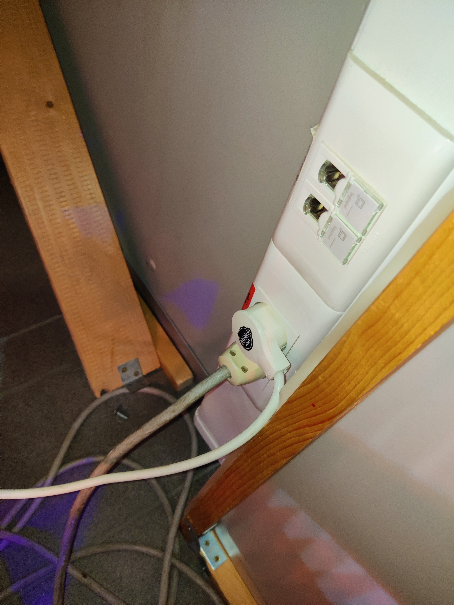
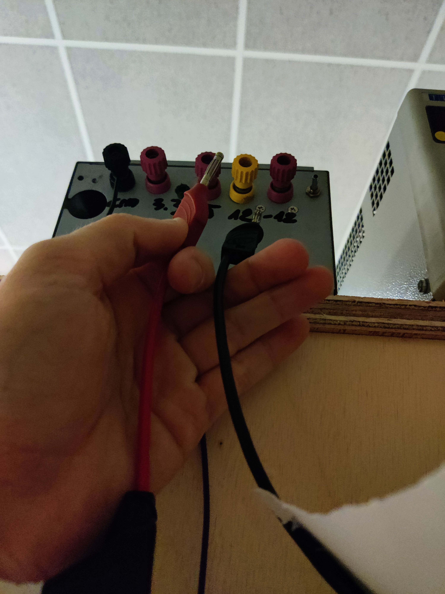
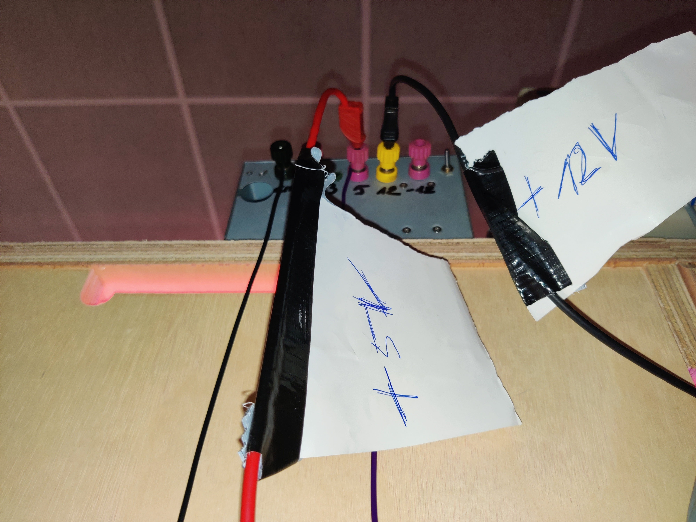
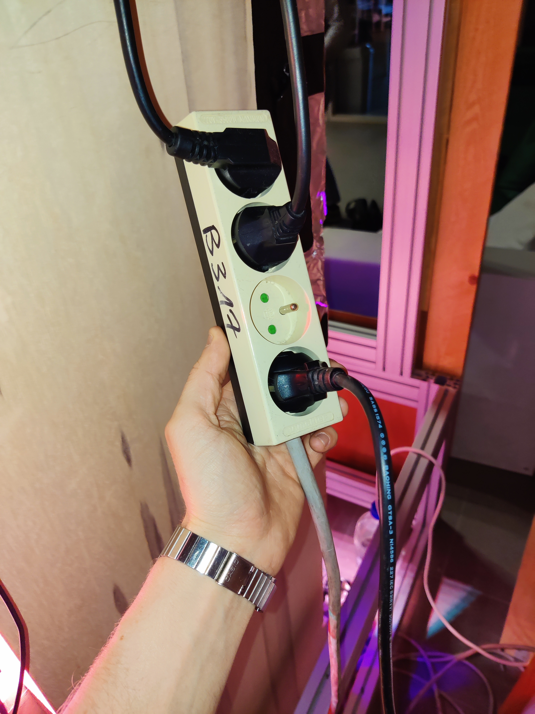
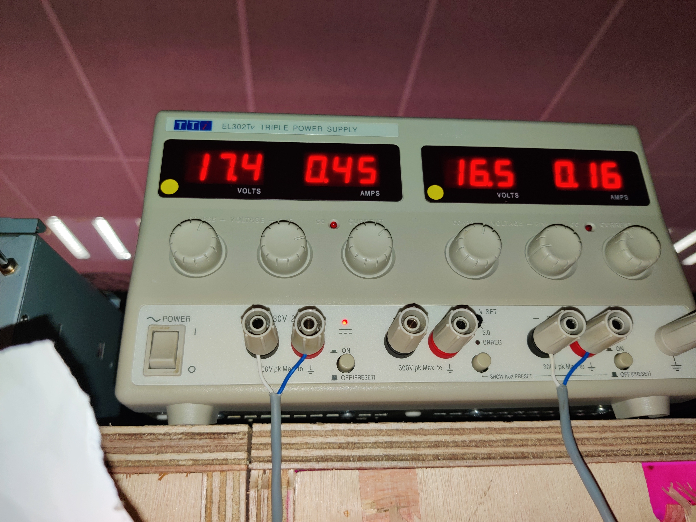
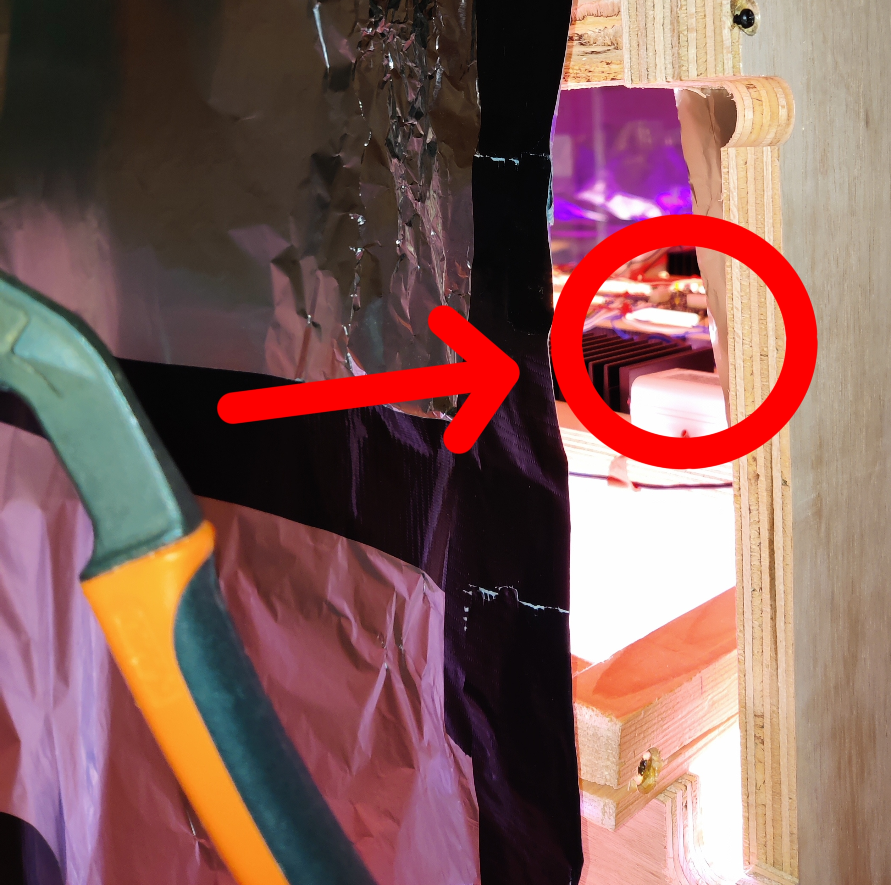

[**LEDs en PCB**](inhoud/leds/) - [**LED aansturing en bronnen**](inhoud/aansturingLEDs/) - [**Energiemonitoring**](inhoud/energiemonitoring/) - [**Watervoorziening**](inhoud/aquaMonitoring/) - [**Dashboard**](inhoud/dashboard/) - [**Modulariteit**](inhoud/modulariteit/) - [**Plantenmonitoring**](inhoud/plantensensor/) - [**Operation**](inhoud/operation/) - [**Logboek**](inhoud/logboek/)

---

# Stappenplan inschakelen VF:

