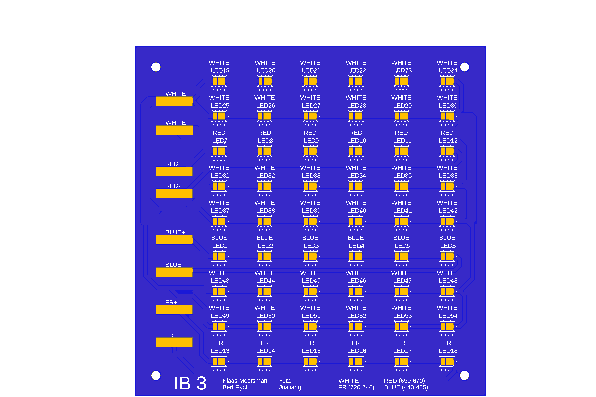

__Yuta en Jualiang__

De volgende selectie van LEDs is gemaakt door Yuta en Juliang.

White LEDs: 72  (L1SP-PNK1002800000)
Blue LEDs: 12  (L1SP-RYL0002800000)
Red LEDs: 12  (L1SP-DRD0002800000)
FR LEDs: 12  (L1SP-FRD0002800000)
[Datasheet] (https://otmm.lumileds.com/adaptivemedia/f0665283471a2a639ce8c3006456265ad074bde9)

Volgende veronderstelling werden gemaakt door hen:
* 80% van het uitgezonden licht bereikt de planten
* licht is 15 cm boven de planten of hun bladeren

Bestellen van LEDs wordt gedaan door de IMLEX studenten.

De LED-PCB wordt opgesplits in twee PCBs om te voldoen aan de afmetingen. 

__Marta Pozzi en Hayato Nakanishi__

Volgend document is opgesteld door Marta en Hayato om de keuze van hun LEDs toe te lichten:

<iframe src="LED_selection_propsal.pdf" width="100%" height="600px"></iframe>

Volgende PCB werd ontworpen:

