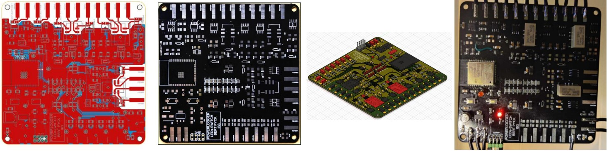
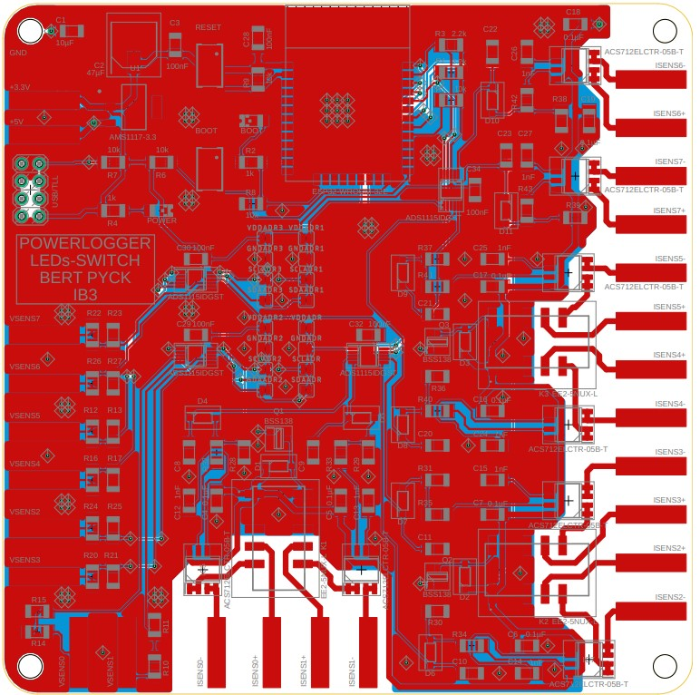
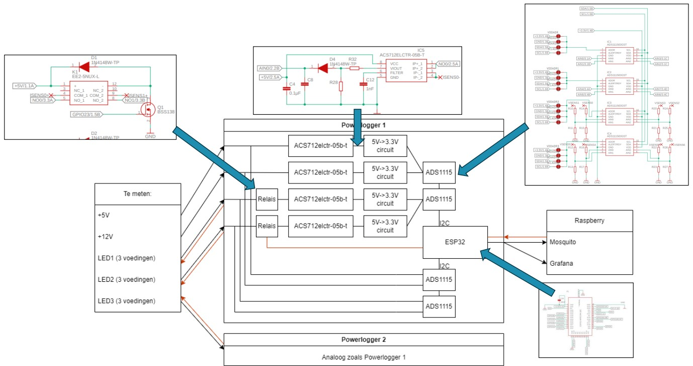
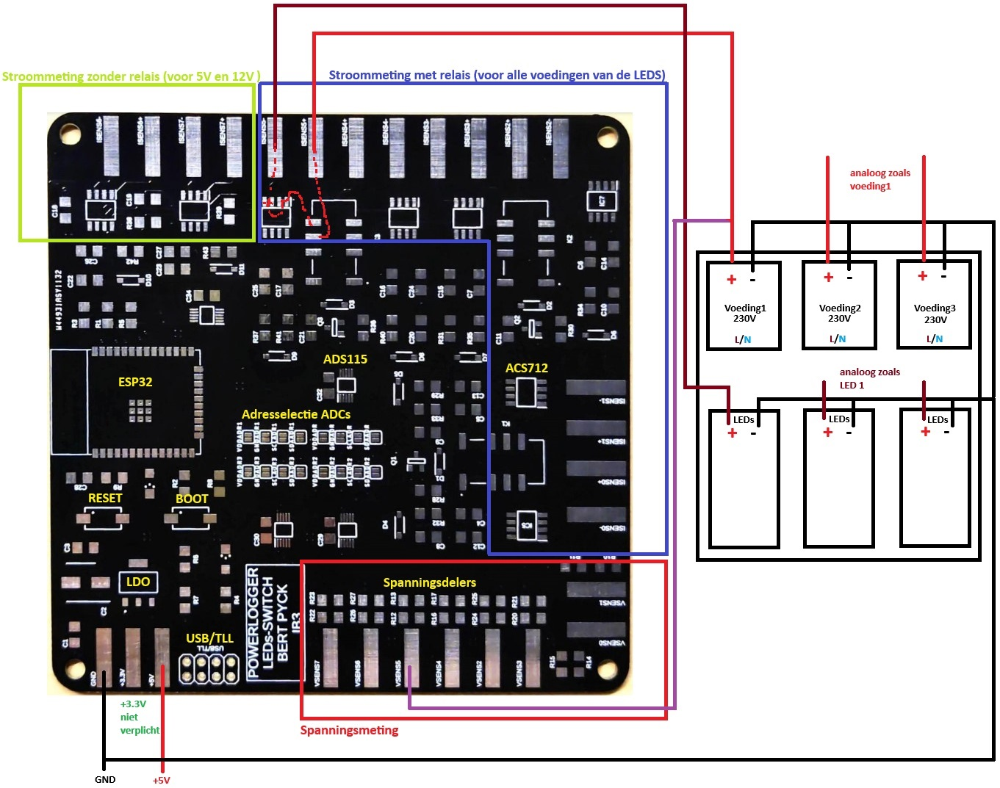
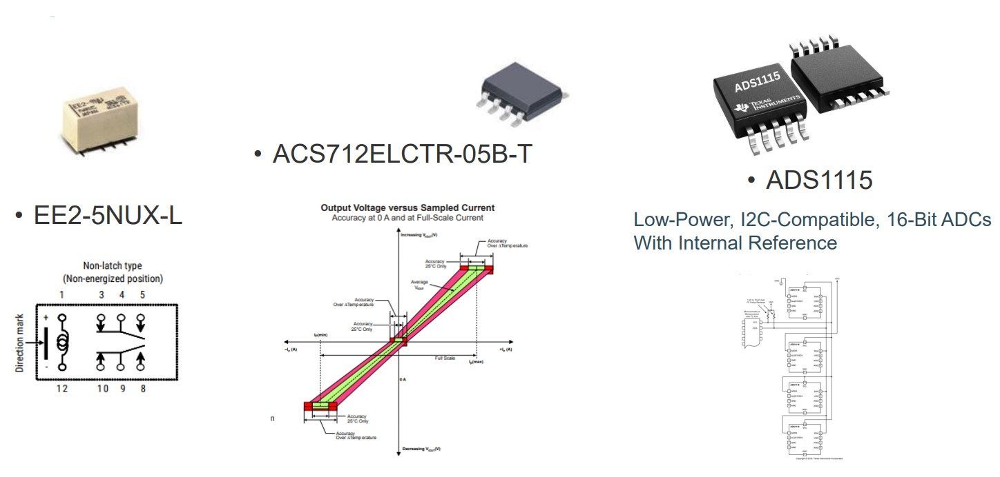
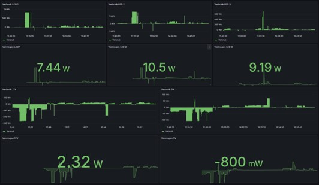
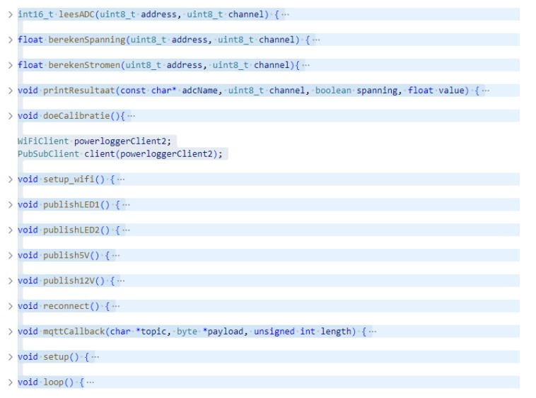
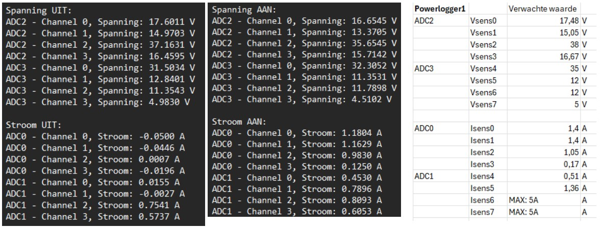

# Energiemonitoringsbordje

## Inleiding

...

## Beschrijving

...

## Schema & PCB

...

## Werking
### Blokschema

...

### Bedrading voor correcte metingen

...

## Componenten

### ADS1115 ADC (Analog-to-Digital Converter)

...

### ACS712 5A

...

### 5V->3.3V converter

...

### ESP32

...

## MQTT

## Code

...

## Slot

<video width="320" height="240" controls>
  <source src="demo.mp4" type="video/mp4">
  Your browser does not support the video tag.
</video>
