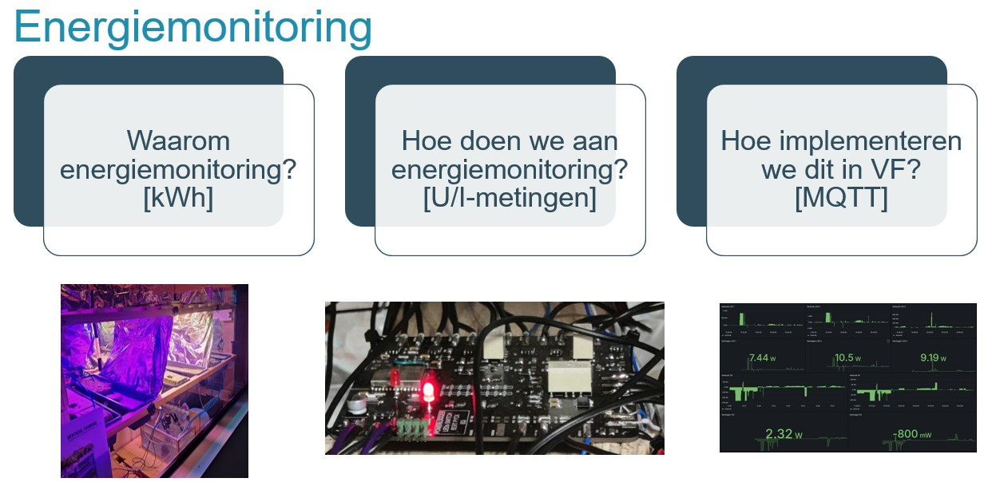

# Energiemonitoringsbordje

## Inleiding

Dit document beschrijft de samenstelling, werking en installatie van een energiemonitoringsbordje. Het bordje is ontworpen om het energieverbruik van verschillende apparaten te meten en te monitoren.

## Beschrijving

Het energiemonitoringsbordje bestaat uit verschillende componenten die samenwerken om het energieverbruik te meten en te registreren. Deze componenten omvatten een microcontroller, analoge en digitale sensoren, spanningsomvormers en een communicatiemodule.

## Schema & PCB

Het schema en de PCB (Printed Circuit Board) zijn ontworpen om de componenten op een gestructureerde en efficiënte manier met elkaar te verbinden. Het schema geeft de elektrische verbindingen weer, terwijl de PCB de fysieke lay-out van de componenten op het bord toont.

## Werking

### Blokschema

Het blokschema geeft een overzicht van de functionele blokken van het energiemonitoringsbordje, inclusief de sensorinterfaces, de microcontroller en de communicatiemodule.

### ADC (Analog-to-Digital Converter)

De ADC zet de analoge signalen van de sensoren om in digitale waarden die de microcontroller kan verwerken. Dit stelt het bordje in staat om nauwkeurige metingen van het energieverbruik uit te voeren.

### ACS (Allegro Current Sensor)

De ACS is een stroomsensor die wordt gebruikt om de stroomsterkte van het aangesloten apparaat te meten. Deze informatie wordt gebruikt om het energieverbruik te berekenen.

### Spanningsomvormers

De spanningsomvormers zetten de wisselstroom (AC) van het elektriciteitsnet om in een lagere gelijkstroom (DC) die geschikt is voor de sensoren en de microcontroller.

### ESP32

De ESP32 is een krachtige microcontroller die wordt gebruikt voor het verwerken van de gemeten gegevens en voor het communiceren met externe apparaten via WiFi of Bluetooth.

## Bedraden

Het bedraden van het energiemonitoringsbordje omvat het correct aansluiten van de verschillende componenten volgens het schema en de PCB lay-out. Dit zorgt voor een goede werking en betrouwbare metingen.

## Code

De code voor het energiemonitoringsbordje omvat de firmware die op de microcontroller draait. Deze firmware verzamelt gegevens van de sensoren, voert berekeningen uit en communiceert met externe apparaten voor gegevensopslag of visualisatie.

## Slot

Het energiemonitoringsbordje biedt een handige en effectieve manier om het energieverbruik van apparaten te meten en te monitoren. Door de nauwkeurige metingen en de flexibele communicatiemogelijkheden is het een waardevol instrument voor energiebewaking en -beheer.

<video width="320" height="240" controls>
  <source src="demo.mp4" type="video/mp4">
  Your browser does not support the video tag.
</video>
