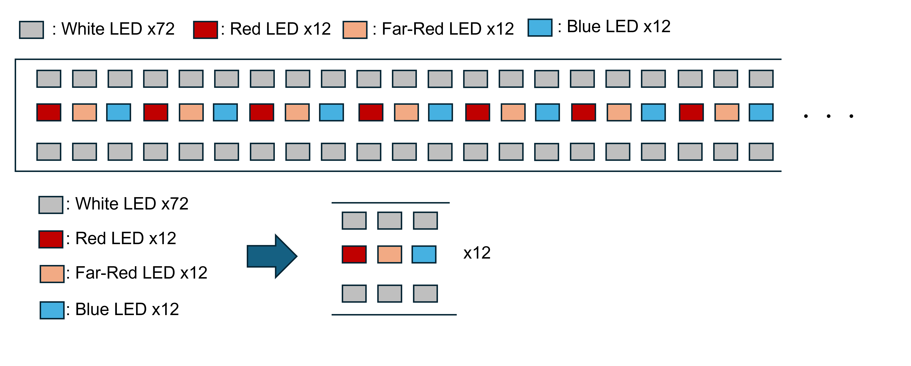

---

# Yuta en Jualiang

De volgende selectie van LEDs is gemaakt door Yuta en Jualiang:

* Wit: 72  (L1SP-PNK1002800000)
* Blauw: 12  (L1SP-RYL0002800000)
* Rood: 12  (L1SP-DRD0002800000)
* Infrarood: 12  (L1SP-FRD0002800000)

[Datasheet](https://otmm.lumileds.com/adaptivemedia/f0665283471a2a639ce8c3006456265ad074bde9)

<iframe src="Proposal_of_LED_from_Yuta_Leo.pdf" width="100%" height="600px"></iframe>

Volgende veronderstelling werden gemaakt door hen:
* 80% van het uitgezonden licht bereikt de planten
* licht is 15cm boven de planten of hun bladeren

De LED-PCB wordt opgesplitst in twee PCBs om te voldoen aan de afmetingen. 

---

# Marta Pozzi en Hayato Nakanishi

Volgend document is opgesteld door Marta en Hayato om de keuze van hun LEDs toe te lichten:

<iframe src="LED_selection_proposal_document.pdf" width="100%" height="600px"></iframe>

Volgende PCB werd ontworpen:

