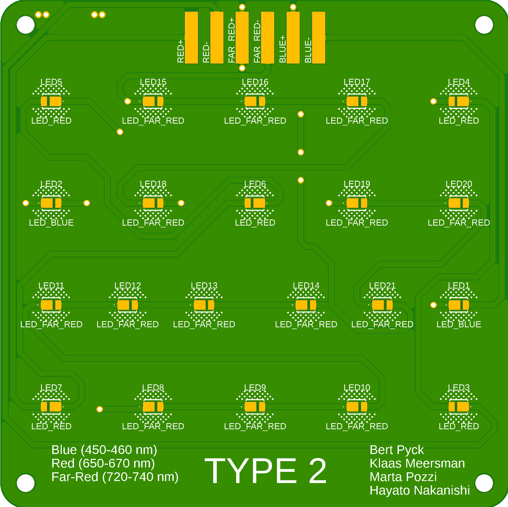

---

# Rechter LED-array: Yuta en Jualiang

De volgende selectie van LEDs is gemaakt door Yuta en Jialiang:

* Blauw: 12  (440-450nm)
* Rood: 12  (650-670nm)
* Infrarood: 12  (720-740nm)
* Wit: 72

[Datasheet](https://otmm.lumileds.com/adaptivemedia/f0665283471a2a639ce8c3006456265ad074bde9)

De keuze voor de LED's wordt als volgt veklaard:
<iframe src="Proposal_of_LED_from_Yuta_Leo.pdf" width="100%" height="600px"></iframe>

Er worden 2 identieke PCB's gebruikt om het beoogde aantal LED's aan te sturen.

---

# Linker LED-array: Marta Pozzi en Hayato Nakanishi

De volgende selectie van LEDs is gemaakt door Marta en Hayato:

* Blauw: 11 (450-460nm)
* Rood: 17  (650-670nm)
* Infrarood: 55  (720-740nm)

De keuze voor de LED's wordt als volgt veklaard:
<iframe src="LED_selection_proposal_document.pdf" width="100%" height="600px"></iframe>

Er werden 2 types PCB gebruikt om de LED's aan te sturen. De LED-array bestaat uit 3 keer type 1 en éénmaal type 2.

Volgende PCB werd ontworpen:

